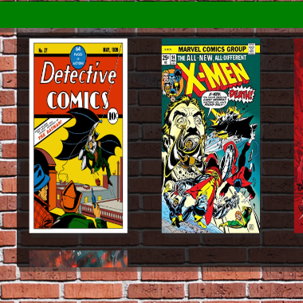

  
  

## Manga Selling Website
This project is an e-commerce website that allows users to create an account, add items to their cart, and save their cart for later use. The website is designed to support future extensions such as a checkout system and a feature that allows users to post their items for sale. The primary goal of this project was to implement basic CRUD functionality. The project was a collaborative effort with Bailey Rechkemmer, and my specific responsibilities included developing the user authentication system and creating and updating items in the CRUD project.

## Feature
When created the project, I was able to learn about user authentication and working with cookies storing it in the database. Further in I realized that is not the best practice but overall it was a cool project to work with and a great experience

## Conclusion

This academic undertaking not only helped me get better at fundamental CRUD operations but also served as a conduit for a nuanced exploration of user authentication mechanisms within the web development landscape. Cheers to creating a space where manga lovers can explore, shop, and even contribute to the vibrant community of manga enthusiasts!
