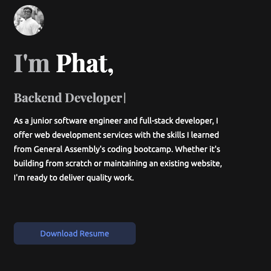

## Professonal Portfolio
My project is my little corner on the internet where I get to show off what I'm all about. Using a mix of HTML, Sass, CSS, and JavaScript, I've whipped up this cool personal portfolio that's not your average resume. It's got a bit of personality and a lot of me in it. I think of it as saying, "Hey world, check out what I can do!". So, whether you're a potential employer or just someone curious about what I bring, this portfolio is where the magic happens.

## Why Sass CSS?
Sass, which stands for Syntactically Awesome StyleSheets, is a preprocessor scripting language worked based on CSS. It is simpler and has more features compare to CSS. One of the features I liked the most about Sass is that its use of variables allowing you to store and reuse the values throughout the stylesheets. 

Check it here: <a href="https://vermillion-custard-ea8a83.netlify.app/#home"><i class="large github icon "></i>Phat's Portfolio</a>
