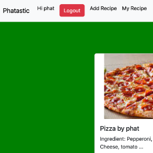

# Recipe Sharing Platform
This project is a web application designed for users to share and explore recipes. The website is fully functional and uses Django for the backend, which includes user authentication. In addition, the application has a nutrient calculator that is integrated with a third-party API. Users can input ingredients, and the calculator will provide the nutrient information for the recipe. This feature is designed to help users make informed decisions about the nutritional value of their recipes. The nutrient calculator is a significant feature of the project and adds value to the user experience.

## Tech Stack
The choice of Django as the primary framework for both the front and back end in this project is a strategic decision that underscores its efficiency and versatility. By leveraging Django, the development process is streamlined, resulting in a robust and seamless web application. The inclusion of a third-party API further enhances the project's capabilities, particularly in delivering precise nutritional information for recipes. This deliberate tech stack ensures a powerful and well-rounded foundation, allowing for the seamless integration of features such as the nutrient calculator. The use of Django not only facilitates the project's development but also contributes to its overall performance and user experience. With this carefully selected tech stack, the project stands as a testament to the effectiveness of Django in building dynamic and feature-rich web applications.

## Why this
The Recipe Sharing Platform holds particular appeal for individuals who enjoy both culinary pursuits and maintaining a healthy lifestyle. For those with a passion for cooking and a commitment to fitness, this application becomes a valuable tool for creating and sharing exceptional recipes. By seamlessly integrating a nutrient calculator, the platform goes beyond the realm of simple recipe sharing. For users like me, this feature offers valuable insights into the nutritional content of recipes, aligning perfectly with a gym-goer's interest in maintaining a balanced and health-conscious diet. Whether you seek to explore new culinary delights or are mindful of the nutritional impact of your meals, the Recipe Sharing Platform caters to your dual interests, fostering a community that celebrates both the joy of cooking and the pursuit of a wholesome lifestyle.
